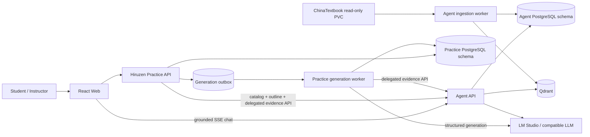
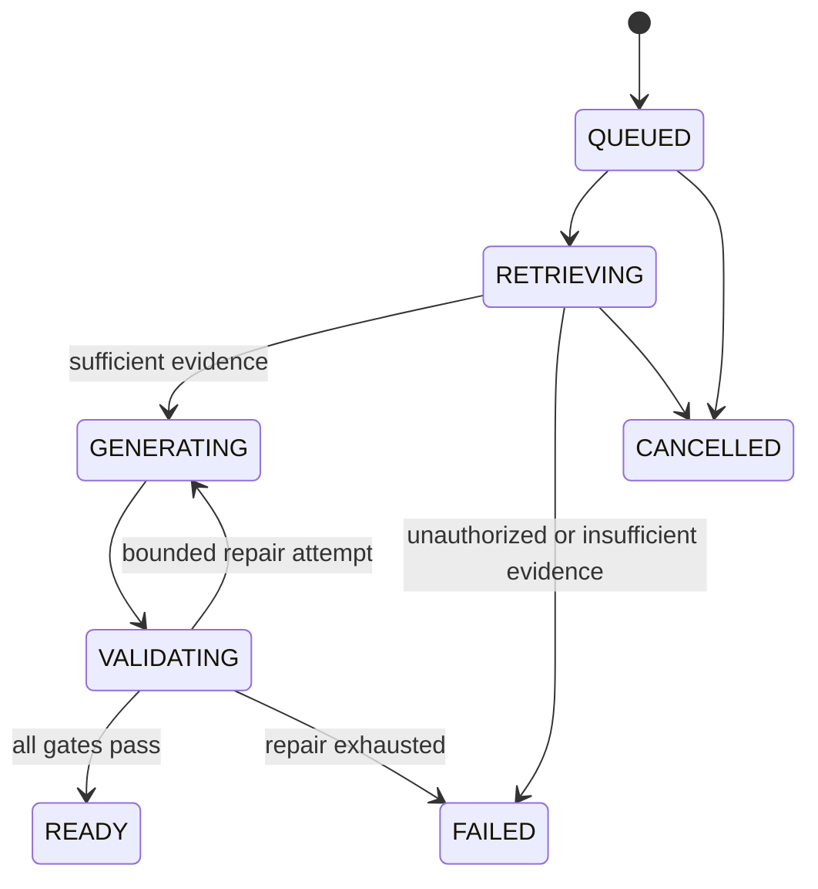

# Hiruzen Design Specification

**Status:** accepted v0.3 architecture; H1/H1a catalog-outline, H2 jobs, H3 grounded generation and H4 attempts/progress implemented
**Updated:** 2026-10-10
**Function specification:** [function_spec.md](function_spec.md)  
**Platform decision:** [ADR-006](../../../docs/adr/006-hiruzen-ownership-and-agent-integration.md)

## 1. Architecture summary

Hiruzen evolves the current dummy Practice API into an independently scalable practice
service. It reuses Agent's catalog, authorization, published content, retrieval and
tutoring chat instead of importing Agent internals or building a second RAG stack.



## 2. Key decisions

1. **No direct NAS access from Hiruzen.** Only the Agent ingestion worker receives the
   ChinaTextbook read-only mount.
2. **No Agent ORM imports or cross-schema joins.** Integration uses versioned HTTP
   contracts and delegated authorization.
3. **One RAG owner.** Agent retrieves textbook evidence and serves live tutoring chat;
   Hiruzen generates exercises from the returned evidence.
4. **Separate write ownership.** Hiruzen owns practice sets, answers, attempts and
   progress in a separate PostgreSQL schema/role, even when both schemas use the same
   server initially.
5. **Asynchronous generation.** API requests create idempotent jobs; a separate worker
   performs retrieval, LLM generation and validation.
6. **Immutable generated sets.** A set is pinned to a content version, evidence IDs,
   prompt/model versions and seed. Regeneration creates a new revision.
7. **Answer material is protected.** Student DTOs and database access paths separate
   question presentation from answer/rationale fields.
8. **Independent deployment.** The current dummy sidecar may remain during transition,
   but production Hiruzen moves to its own Deployment and scaling policy.

## 3. Bounded contexts and ownership

| Concern | Agent | Hiruzen |
|---|---|---|
| Tenant, identity, course membership | Authoritative | Consumes verified identity and Agent authorization |
| NAS scanning and textbook parsing | Owns | No access |
| Categories, books, publisher/grade/subject metadata | Authoritative | Facade/cache only |
| Course/CourseRun and active ContentVersion | Authoritative | References IDs |
| Chunk retrieval and citations | Owns | Requests bounded evidence |
| Live tutoring RAG | Owns | Supplies navigation/context only |
| Generation policy and PracticeSet | No ownership | Owns |
| Answer keys and grading provenance | No ownership | Owns |
| Attempts, progress and resume cursor | Optional compact memory signal | Owns |

The Practice database must not use foreign keys into Agent tables. Agent identifiers
are opaque UUIDs plus captured version metadata.

## 4. Catalog model and ChinaTextbook onboarding

The NAS host path supplied for the corpus is:

```text
/var/services/homes/lvjial/ChinaTextbook
```

The current macOS development mount is:

```text
/Volumes/home/ChinaTextbook
```

On Kubernetes it is exposed to the Agent ingestion worker through an existing read-only
PVC at a configurable path such as:

```text
/data/content/china-textbook
```

Neither value is accepted from an end-user request. Host paths belong only in local
deployment configuration.

A read-only inventory on 2026-10-07 confirmed an approximately 85 GiB checkout with
1,905 complete PDFs. The first pilot family is under `小学/英语` and contains four
distinct FLTRP/外研社 series totaling 36 PDFs. See
[china-textbook-inventory.md](china-textbook-inventory.md). Catalog identity must
therefore include series/start-grade/editor metadata rather than treating “外研社版” as
one edition.

### 4.1 Agent catalog additions

Agent requires an authoritative catalog layer above SourceRoot/SourceDocument:

- `Category`: stable key, display name, parent and category type.
- `Publisher`: normalized name and aliases.
- `Book`: title, subject/module, education level, grade, publisher, edition,
  term/volume, language, optional ISBN/cover and lifecycle status.
- `BookContentBinding`: book ID, course/run ID, SourceRoot/source IDs and published
  ContentVersion.
- `BookCourseBinding`: many-to-many association between books and CourseRuns.

An import adapter may extract candidate metadata from the ChinaTextbook directory and
filename conventions, but it writes to a staging result first. Ambiguous publisher,
grade, subject or edition values require an override/approval manifest before the book
becomes searchable. Runtime search never reparses filesystem paths.

The accepted first-release activation state machine is:

```text
SCANNED -> STAGED -> APPROVED -> INGESTING -> READY -> PUBLISHED
              |          |          |            |
              +-> REJECTED          +-> FAILED   +-> FAILED
```

- Every candidate starts staged; there is no scan-to-publish shortcut.
- Admins may batch-approve candidates with no parser issues. Candidates with issues
  require corrected metadata first.
- Approval creates one Book plus a system-managed Agent Course/CourseRun for the PDF
  volume and queues the existing ingestion lifecycle.
- The system CourseRun is marked `tenant_authenticated`; Agent derives access from the
  verified tenant for these catalog courses. Existing instructor-managed courses keep
  explicit membership ACLs, and request fields cannot select or elevate this policy.
- A Book becomes searchable only when its bound ContentVersion is explicitly published.
- Publication is not automatic, and a failed/rolled-back version updates catalog state
  without deleting the Book or historical bindings.

### 4.2 Hiruzen catalog facade

Hiruzen exposes product-specific catalog routes but delegates authoritative reads to
Agent. A short TTL cache may hold only public metadata and must include tenant and
authorization scope in its key. Cache failure falls back to Agent; stale authorization
data is never used to grant access.

## 5. Service-to-service contracts

### 5.1 Authentication

- Browser calls use the learner's OIDC/JWT token. Catalog and outline HTTP calls forward
  that bearer to Agent, which performs normal learner authorization.
- After verifying the learner at generation submission, Hiruzen issues a signed,
  five-minute, job-scoped delegation token for its asynchronous worker. The token binds
  tenant/user/access rank, generation, Book, Course and ContentVersion; the original
  browser bearer is not persisted in the job.
- Agent verifies the delegation signature and scope, then rechecks the current
  published Book/CourseRun/ContentVersion binding. This first-release endpoint accepts
  only `tenant_authenticated` ChinaTextbook runs; other course policies fail closed.
  Both services receive the signing secret through runtime Secret configuration.
- Production workload identity and token rotation are deployment-hardening work in
  TASK-23. OIDC issuer, audience and claim mapping remain deployment configuration.
- Correlation ID propagates from the job to Agent and LM Studio HTTP requests; Agent
  records a retrieval trace ID on the resulting PracticeSet.

### 5.2 Required Agent operations

The catalog operations are implemented and versioned by TASK-18, the outline operation
by TASK-24, and the practice-evidence operation by TASK-20.

| Operation | Method/path | Purpose |
|---|---|---|
| `listCatalogCategories` | `GET /v1/catalog/categories` | Authorized categories/facets and counts |
| `searchCatalogBooks` | `GET /v1/catalog/books` | Authorized cursor-paginated Book search |
| `getCatalogBook` | `GET /v1/catalog/books/{book_id}` | Book detail and current publication state |
| `listCatalogBookCourses` | `GET /v1/catalog/books/{book_id}/courses` | Authorized CourseRuns for a Book |
| `getCatalogBookOutline` | `GET /v1/catalog/books/{book_id}/outline` | Authorized outline for the exact published Book/ContentVersion |
| `retrievePracticeEvidence` | `POST /v1/internal/practice/evidence:retrieve` | Bounded evidence for generation, including immutable chunk citations |
| `streamCourseChat` | `POST /v1/courses/{course_id}/chat` | Existing grounded SSE tutoring endpoint used directly by the browser |
| `createCatalogImport` | `POST /v1/admin/catalog/imports` | Queue a configured SourceRoot/prefix catalog scan |
| `getCatalogImport` | `GET /v1/admin/catalog/imports/{import_id}` | Read batch counts and lifecycle state |
| `listCatalogImportCandidates` | `GET /v1/admin/catalog/imports/{import_id}/candidates` | Review staged candidates without absolute paths |
| `updateCatalogImportCandidate` | `PATCH /v1/admin/catalog/imports/{import_id}/candidates/{candidate_id}` | Correct staged metadata before approval |
| `approveCatalogImportCandidate` | `POST /v1/admin/catalog/imports/{import_id}/candidates/{candidate_id}/approve` | Create Book/system CourseRun and queue ingestion |
| `rejectCatalogImportCandidate` | `POST /v1/admin/catalog/imports/{import_id}/candidates/{candidate_id}/reject` | Reject without deleting scan evidence |

`retrievePracticeEvidence` accepts a job-scoped delegation token and exact Book,
Course and ContentVersion IDs, plus a bounded query and evidence limit. Module title or
topic is translated to a query by Hiruzen; difficulty and question types remain in the
generation request, not the retrieval contract. Agent performs publication and
version-pinned ACL filtering and returns:

- `course_id`, `book_id`, `content_version_id`;
- ordered chunk IDs and source/page/slide anchors;
- bounded evidence text;
- retrieval trace ID, scores and policy version;
- allowed content classes (currently instructional `content` only) and solution-release
  policy.

It never returns evidence above the delegated user's access rank.

### 5.3 Live chat

The browser calls Agent's existing:

```text
POST /v1/courses/{course_id}/chat
```

using `assessment_mode=true`, the current attempt number and a question containing the
visible exercise context. Agent remains responsible for RAG, hints, citations, memory
and SSE. Hiruzen returns navigation metadata (`course_id`, safe exercise context and
optional correlation ID), not a second chat stream.

## 6. Hiruzen components

```text
apps/practice/src/course_tutor_practice/
├── app.py                  # FastAPI factory and dependency lifecycle
├── routes/
│   ├── catalog.py          # Agent-backed category/book/course facade
│   ├── generations.py      # Generation commands and job status
│   ├── practice_sets.py    # Safe question/read models
│   ├── attempts.py         # Submission and feedback
│   └── progress.py         # Status and resume
├── application/
│   ├── generation.py       # State machine/orchestration
│   ├── evaluation.py       # Deterministic/rubric evaluation
│   └── progress.py         # Derived progress policies
├── domain/
│   ├── exercises.py        # Question and protected-answer models
│   ├── study.py            # StudyPlan/progress models
│   └── policies.py
├── adapters/
│   ├── agent_client.py     # Versioned HTTP client only
│   ├── inference.py        # Shared OpenAI-compatible provider
│   └── persistence.py
└── db/
    └── models.py

apps/practice/alembic/versions/  # separately owned Practice schema migrations
services/practice_worker/   # generation/outbox consumer when extracted
```

The initial worker can share the Practice package and image with a different process
entrypoint; it remains a separate Kubernetes Deployment.

### 6.1 Default StudyPlan and outline ownership

Agent ingestion owns structural textbook extraction and returns a versioned outline of
reliable table-of-contents/heading nodes for a published Book. Hiruzen deterministically
maps those nodes to ordered Chapter/Topic modules. It does not use an LLM to infer the
outline or learning objectives. If Agent returns no reliable outline, the plan contains
one book-level module with an empty objective list. First-release StudyPlans are
read-only defaults; authoring/revision endpoints are post-MVP.

TASK-24 implements this boundary with the following deterministic precedence:

1. embedded PDF bookmarks;
2. reliable table-of-contents text and heading rules;
3. OCR only when the document has no reliable text layer.

The canonical extractor never relies on unconstrained LLM output. Each response carries
`book_id`, `content_version_id`, `AVAILABLE`/`UNAVAILABLE` status, extractor version,
confidence/provenance and ordered nodes with stable ID, parent, depth, title, ordinal
and page range. Low-confidence or invalid structure is explicitly `UNAVAILABLE`; no
chapter or objective is inferred. Hiruzen accesses the operation through an
`OutlineProvider` port and applies the one-book-module fallback for unavailable output.

## 7. Persistence model

Hiruzen uses a `practice` schema and a database role that cannot read Agent tables.

| Table | Important fields |
|---|---|
| `study_plans` | tenant, Agent book/course IDs, name, policy, status, revision |
| `study_plan_modules` | plan, ordinal, topic, objectives, generation defaults |
| `generation_jobs` | user, idempotency key, request, state, deadline, error, correlation ID |
| `practice_sets` | job, user/plan, Agent IDs, content version, seed, prompt/model/validator versions |
| `exercises` | set, ordinal, type, prompt, difficulty, protected answer/rationale, fingerprint |
| `exercise_citations` | exercise, chunk/source ID, path-safe display metadata and anchor |
| `attempts` | user, exercise revision, submitted answer, result, evaluator provenance |
| `study_activity` | idempotent learner events used for derived progress |
| `study_progress` | materialized counters/mastery and last activity |
| `resume_cursors` | user, plan/set/exercise and safe UI state |
| `exercise_reports` | learner report reason and moderation state |

Answer/rationale columns are never selected into learner question DTOs before release.
Application tests inspect generated SQL/read models to prevent accidental leakage.

## 8. Generation pipeline



### 8.1 Steps

1. Validate request and idempotency key; persist `QUEUED` job.
2. Worker claims the job with a lease/row lock.
3. Call Agent evidence retrieval with delegated authorization.
4. Pin Agent content/retrieval metadata to the job.
5. Build a versioned structured-output prompt for the requested types and difficulty.
6. Call the configured OpenAI-compatible LLM with a JSON schema.
7. Parse into Pydantic domain models; reject unknown fields.
8. Run deterministic gates:
   - requested count/type;
   - citation IDs belong to returned evidence;
   - each question has a supported answer;
   - option cardinality and one-correct-answer rules;
   - normalized duplicate/fingerprint detection;
   - answer/rationale not present in student-visible prompt;
   - unsafe or solution-prohibited evidence excluded.
9. Optionally perform one bounded model-based groundedness/ambiguity review.
10. Persist immutable `READY` set or a sanitized failure reason.

No generation retry occurs after the deadline, and a retry never creates a second set
for the same successful idempotency key.

## 9. Question and answer contracts

The internal exercise aggregate separates:

```text
QuestionView
  id, type, prompt, options?, difficulty, citations

ProtectedAnswer
  canonical answer, accepted variants?, rationale, rubric?, citations
```

The implementation contract is a discriminated union:

| Type | Learner-visible fields | Protected fields and validation |
|---|---|---|
| `multiple_choice` | prompt, 2–6 `{id,text}` options | one `correct_option_id`; ID must belong to options |
| `true_false` | prompt | boolean `correct_value` |
| `fill_blank` | prompt containing at least one blank marker | 1–10 `accepted_answers`; Unicode NFKC, whitespace and configured case normalization |
| `short_answer` | prompt | exemplar plus 1–5 rubric criteria whose weights total 1; provisional pass threshold defaults to 0.70 |

Shared fields are `type`, `prompt`, `difficulty`, `language`, and non-empty citation
IDs. Difficulty is `introductory`, `standard` or `challenge`; question language is
`zh`, `en` or `bilingual` and defaults to `zh`. Generation defaults to five questions
and accepts 1–20. UI language is a separate learner preference.

Learner list/get endpoints return only `QuestionView` and attempt state. Answer
submission returns feedback according to release policy. Instructor preview requires an
explicit privileged endpoint/read model and audit event.

## 10. Study progress and resume

- Attempts and activity events are immutable and carry idempotency keys.
- `study_progress` is a rebuildable projection containing counts, completion and
  bounded topic-level mastery signals.
- Resume cursor updates only after a meaningful event such as opening a set, submitting
  an answer or moving to the next exercise.
- Resume verifies that the referenced book/course/set is still authorized. If not, it
  falls back to the latest accessible item without exposing stale content.
- Progress survives a new textbook version; an existing PracticeSet remains pinned to
  its original version, while new generation uses the latest published version.
- Any signal sent to Agent memory is compact, consent-aware and contains no answer text.
- Hiruzen persists an explicit learner opt-in for study-memory sharing. The versioned
  `hiruzen.study.v1` read contract emits at most one bounded mastery signal per
  StudyPlan; there is no automatic raw-attempt/answer export. A future Agent consumer
  must independently enforce its own memory consent before storing a signal.
- First release applies no time-based automatic deletion to attempts or progress.
  Explicit privacy export/deletion follows the platform policy and must preserve any
  legally required audit tombstone; retention changes are configuration, not LLM policy.

## 11. Deployment evolution

The existing chart runs Agent and the dummy Practice container in one backend Pod.
That arrangement is acceptable only during the transition.

Target workloads:

| Workload | Scale trigger | Dependencies |
|---|---|---|
| Agent API Deployment | chat/API traffic | Agent DB, Redis, Qdrant, LM Studio |
| Hiruzen API Deployment | catalog/attempt/progress traffic | Practice DB, Agent API |
| Hiruzen Worker Deployment | generation queue depth | Practice DB, Agent API, LM Studio |
| Agent ingestion worker | ingestion queue | NAS, Agent DB, Qdrant, LM Studio |
| Web Deployment | HTTP traffic | Agent and Hiruzen services |

The Helm chart retains one release but gains independent replicas, resources, HPA/PDB,
Services and NetworkPolicies for Hiruzen API and worker. Practice API no longer mounts
the course-content PVC.

## 12. Failure handling

| Failure | Behavior |
|---|---|
| Agent unavailable | Catalog may use a short safe cache; new generation remains queued/retryable; progress stays readable |
| LM Studio unavailable | Job retries with bounded backoff, then fails transparently |
| Evidence insufficient | Non-retryable `INSUFFICIENT_EVIDENCE`; no questions persisted |
| Invalid LLM JSON | One bounded repair attempt, then `VALIDATION_FAILED` |
| Worker crash | Lease expires and another worker resumes idempotently |
| Content version changes | In-flight job remains pinned; new jobs use the newly published version |
| User loses access | Agent denies evidence/chat; Hiruzen denies set/resume on the next authorization check |

## 13. Observability

Metrics include generation state/count/duration, Agent and LLM latency, validation
failure reason, generated question type, attempt outcome, resume success and queue age.
Labels use bounded enums and never use user, book, course, prompt or answer text.

Traces connect browser request, Hiruzen job, Agent retrieval trace and LM request through
correlation IDs. Logs store IDs, versions and sanitized error codes only.

## 14. Test strategy and quality gates

1. Domain unit tests for schemas, leakage guards, grading and progress projection.
2. Agent-client contract tests generated from both OpenAPI specifications.
3. Disposable integration tests with separate Agent/Practice schemas and fake providers.
4. Generated-book E2E: catalog -> generate -> submit -> feedback -> resume -> Agent chat.
5. Golden-set evaluation for groundedness, ambiguity, duplicate rate and difficulty.
6. Authorization tests for tenant/course leakage and instructor-only answer preview.
7. Migration round trip and schema ownership tests.
8. Helm/Kind tests proving independent Hiruzen API/worker scaling and no NAS mount.
9. Real NAS/LM Studio acceptance remains a manual, redacted release gate and never
   runs in hosted CI.

The first manual golden set uses the primary-school English FLTRP Grade-3-start series,
editor Chen Lin, Grade 3 first-term volume. Its manifest contains only checksums,
question/evidence labels and reviewer decisions; textbook pages are never committed.

## 15. Delivery slices

| Slice | Outcome | Dependency |
|---|---|---|
| H1 — Catalog contract | Agent book metadata/import staging and Hiruzen search facade | Current Agent ingestion |
| H1a — Textbook outline | Deterministic Agent outline extraction, persistence and authorized API | H1 |
| H2 — Persistence and jobs | Practice schema, `OutlineProvider`, generation job state machine and worker | H1; parallel with H1a |
| H3 — Grounded generation | Agent evidence API, structured generation and validators | H1, H2 |
| H4 — Attempts/progress | Submission, evaluation, status and resume | H2, H3 |
| H5 — Chat/UI | Book discovery, real Chapter/Topic practice screens and direct Agent SSE help | H1–H4, H1a |
| H6 — Deployment/quality | Independent Helm workloads, CI/E2E and golden-set gates | H1–H5 |
| H7 — Instructor preview | Privileged, read-only PracticeSet answer view, audit and labeled Web preview | H1–H5; independent of H6 |

Implementation tasks TASK-18 through TASK-24 implement H1–H6 and H1a; TASK-25
tracks H7 separately. TASK-19 and TASK-24 are deliberately parallel behind the
`OutlineProvider` contract. Their
requirement and verification coverage is maintained in
[requirements-traceability.md](requirements-traceability.md). H2 accepts and persists
generation jobs through the versioned API. H3 provides Agent-scoped evidence retrieval,
schema-constrained generation, deterministic validation and sanitized failures. H6/TASK-23
still owns independent Practice migration/worker Helm workloads and release-wide quality
gates; implementing H3 alone does not make the new worker available in the current chart.

H1/TASK-18 was completed on 2026-10-07; H2/TASK-19 completed on 2026-10-08 and
H1a/TASK-24 completed on 2026-10-09. H3/TASK-20 completed its scoped fake-provider,
cross-service and redacted real-pilot acceptance on 2026-10-10. H4/TASK-21 and
H5/TASK-22 completed on 2026-10-10. H6/TASK-23 and H7/TASK-25 remain planned.
