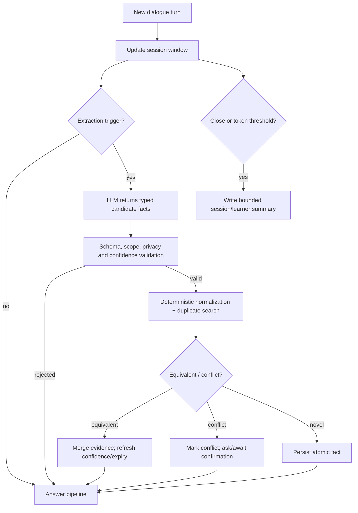

# Design Specification & Delivery Plan — AI Course Tutor Agent

**Status:** Draft v0.1  
**Companion:** [Function Specification](function-spec.md)

## 1. Implementation principles

- Begin as a modular Python service suite in one repository and one local Compose deployment; preserve contracts and deployment manifests so components can be extracted without changing product behavior.
- Use Python 3.12, FastAPI, Pydantic, SQLAlchemy/Alembic, async HTTP clients, PostgreSQL, Qdrant, Redis and an object-store adapter. Use React 18+, TypeScript and Vite in `apps/web`.
- Isolate all LLM calls behind a provider interface. The first provider is LM Studio; tests use a deterministic fake provider.
- Build an evaluation fixture from real but permission-cleared Leeds content before optimizing prompts. Retrieval quality and citations are release gates.
- Never put NAS credentials, source documents, model responses containing personal data, or raw transcripts in source control.

## 2. Repository layout

```text
ai-course-tutor-agent/
├── apps/
│   ├── api/                 # FastAPI BFF/gateway
│   └── web/                 # React + TypeScript UI
├── services/
│   ├── ingestion/           # scanning, parsing, chunking, indexing jobs
│   ├── retrieval/           # hybrid search, rerank, citations
│   ├── memory/              # session + long-term learner memory
│   └── orchestrator/        # agent workflow and policy enforcement
├── packages/
│   ├── contracts/           # OpenAPI/event/domain schemas
│   └── shared/              # config, observability, IDs only
├── infra/
│   ├── docker/              # local Compose
│   └── k8s/                 # Helm/Kubernetes manifests, later phase
├── docs/
│   ├── function-spec.md
│   ├── design-spec.md
│   ├── adr/                 # architecture decision records
│   └── diagrams/
├── scripts/                 # non-secret developer/admin helpers
├── tests/
│   ├── integration/
│   └── e2e/
└── data/                    # ignored runtime development data
```

## 3. Service contracts and core entities

### Core entities

| Entity | Required fields |
|---|---|
| Course | `id`, `tenant_id`, `name`, `level`, `active_content_version`, `source_root_id` |
| ContentVersion | `id`, `course_id`, `pipeline_version`, `status`, `published_at` |
| SourceDocument | `id`, `version_id`, `relative_path`, `checksum`, `mime_type`, `access_label`, `extraction_status` |
| Chunk | `id`, `source_id`, `ordinal`, `text`, `anchor_type`, `anchor_value`, `embedding_model_version` |
| ChatSession | `id`, `user_id`, `course_id`, `rolling_summary`, `expires_at` |
| MemoryFact | `id`, `user_id`, `course_id?`, `type`, `normalized_value`, `confidence`, `importance`, `evidence_ids`, `status`, `expires_at`, `supersedes_id?` |
| RetrievalTrace | `id`, `request_id`, `query`, `candidate_ids`, `reranked_ids`, `scores`, `content_version` |

### Initial API surface

| Endpoint | Contract |
|---|---|
| `POST /v1/chat/streams` | Authenticated SSE stream; body: course/session/message; events: `token`, `citation`, `warning`, `done`, `error` |
| `GET /v1/courses/{id}/sources/{sourceId}` | Returns permission-checked source metadata and page/slide anchors |
| `POST /v1/admin/courses/{id}/ingestions` | Queues scan/index job; returns job ID |
| `GET /v1/admin/ingestions/{jobId}` | Job progress, failures and version status |
| `GET /v1/memories` | Lists current user’s scoped memory with provenance and expiry |
| `PATCH /v1/memories/{id}` | Correct/pin/delete a memory fact |
| `POST /v1/feedback` | Stores answer/citation feedback linked to request ID |

Internally use versioned Pydantic DTOs; publish OpenAPI from API gateway and AsyncAPI/event schemas from `packages/contracts`.

## 4. Retrieval implementation decisions

1. **Parsing:** Apache Tika/Unstructured-style parser adapter for PDF/DOCX/PPTX plus OCR adapter for scanned pages. Store both plain text and structure anchors. Keep per-format parsers swappable.
2. **Chunking:** structure-first chunks (slide/page/heading), then token-aware splits with overlap. Target 350–700 tokens; retain page/slide anchors and adjacent headings. Exercise questions and solutions are separate chunk classes.
3. **Indexing:** calculate file checksum; skip same `(course, checksum, pipeline version)`. Embed chunks, write Qdrant payload filters and PostgreSQL metadata through outbox-backed jobs.
4. **Search:** query rewrite only when needed; dense + BM25/sparse recall; reciprocal-rank fusion; cross-encoder or local LLM rerank; optional parent-document expansion. All candidates have tenancy/course/version/ACL filters before result selection.
5. **Answer policy:** evidence pack is capped by tokens and source diversity. Prompt requires inline source identifiers; server validates cited IDs against the retrieval trace before emitting final citations.
6. **Evaluation:** versioned benchmark questions with expected source anchors, Recall@k, MRR, citation precision, groundedness review and latency. Do not use synthetic-only scores as launch evidence.

## 5. Memory implementation decisions



- Facts are canonical records in PostgreSQL. A memory vector index, if introduced, is only a recall accelerator and must be regenerated from canonical records.
- Use a typed schema with closed enums; no free-form “memory” blobs. Example: `{"type":"knowledge_level","normalized_value":"understands Bayes rule; needs conditional-independence examples","course_id":"...","confidence":0.78,"evidence_turn_ids":["..."]}`.
- Deduplicate first by `(user, course scope, type, normalized key)`, then semantic similarity. Merge does not overwrite provenance.
- Decay `confidence` and relevance based on time/type; pinned memories do not decay. Misconception/mastery facts have short review windows and need fresh evidence.
- Prompt budget: rolling summary ≤ 500 tokens; recalled long-term memories ≤ 8 facts/350 tokens; all raw turn windows have a fixed token cap.
- Deletion writes a tombstone immediately; async workers purge derived summary/vector representations and record completion.

## 6. Work breakdown

### Phase 0 — Foundation and decisions (2–3 days) — **complete**

- [x] Create Python and React toolchains, package manager lockfiles, lint/test hooks, CI, `.env` validation, and secret scanning.
- [x] Add ADR-001 Python/FastAPI and ADR-002 modular-monolith-to-services extraction policy. (Also ADR-003, embedding model/dimension.)
- [x] Define Course/ContentVersion/Source/Chunk/Chat/Memory schemas and Alembic initial migration.
- [x] Implement structured logging, correlation IDs, OpenTelemetry stubs, health/readiness endpoints.
- [x] Create Compose dev stack and deterministic test doubles for LLM, embedder and object store.

**Exit:** `docker compose` starts dependencies; API health check and test suite run locally without NAS or LM Studio. — **met.** Migration also verified reversible and re-appliable, with `alembic check` confirming model/schema parity.

Deferred from Phase 0: the React toolchain in `apps/web` is scaffolded in Phase 2, when
there is an API for it to call.

### Phase 1 — Course ingestion (4–6 days)

- [ ] Implement source-root registration using local mounted POSIX paths only; validate read access and prohibit symlink escape.
- [ ] Create scheduled scanner and job queue; use checksum + pipeline version idempotency keys.
- [ ] Implement PDF, PPTX, DOCX, Markdown/text extractors; persist extraction artifact and page/slide anchors.
- [ ] Add OCR fallback/quarantine path and ingestion status/errors.
- [ ] Write normalized source/chunk metadata, MinIO artifact adapter and active content-version publish/rollback.
- [ ] Add admin ingestion APIs and a minimal status UI.

**Exit:** a copied Leeds sample module can be scanned twice with no duplicate chunks; PPT/PDF citations resolve to correct anchors.

### Phase 2 — Retrieval and grounded chat (5–7 days)

- [ ] Implement LM Studio provider adapter for embeddings and streaming chat; model/embedding compatibility health checks.
- [ ] Build Qdrant collection lifecycle, hybrid dense/sparse indexing and tenant/course/version/ACL payload filters.
- [ ] Implement retrieval API: lexical+dense recall, fusion, rerank interface, evidence-pack builder, source diversity limits.
- [ ] Implement orchestrator prompt policy, abstention behavior, citations and SSE response protocol.
- [ ] Build React chat, course selector, streaming renderer and cited-source panel.
- [ ] Seed a permission-cleared retrieval benchmark and report Recall@k/citation precision.

**Exit:** end-to-end question uses only the selected course’s active content and renders valid citations; a no-evidence query abstains.

### Phase 3 — Optimized memory and teaching experience (5–7 days)

- [ ] Implement session window + rolling-summary thresholds and token accounting.
- [ ] Define closed memory schema and JSON extraction prompt; implement validation, PII/scope guardrails and evidence links.
- [ ] Implement normalize, duplicate/conflict detection, merge, confidence/expiry, tombstones and purge jobs.
- [ ] Implement scoped memory recall/ranking and prompt-budget enforcement.
- [ ] Add learner memory UI: inspect, correct, pin, export, delete; show why a memory was used where appropriate.
- [ ] Add teaching-level and assessed-work hint policy; test bilingual flows.

**Exit:** repeated facts result in one canonical memory; corrected/deleted memory is not recalled; exercise flow respects hint-first policy.

### Phase 4 — Production resilience, quality and security (5–8 days)

- [ ] Add OIDC integration, RBAC, tenant isolation tests, audit events, rate limits and retention controls.
- [ ] Add transactional outbox, retries/dead-letter handling, idempotency and worker restart tests.
- [ ] Add Prometheus/OpenTelemetry dashboards, SLO alerts and LLM/Qdrant/Postgres health dependency reporting.
- [ ] Add backup/restore runbook, Qdrant snapshot procedure and data-deletion verification.
- [ ] Add Kubernetes/Helm manifests, HPA settings, secrets integration and separate local inference-node routing.
- [ ] Run load, failure-injection, security and RAG evaluation tests; document operational runbooks.

**Exit:** verified restore, failed dependency behavior, tenant isolation, performance baseline and deployment runbook.

## 7. Prioritized backlog and dependencies

| Priority | Item | Depends on |
|---|---|---|
| P0 | Course/content schema + source-root validation | Phase 0 |
| P0 | Ingestion parser/chunker/version index | source schema, object store, queue |
| P0 | LM Studio adapter + retrieval + SSE chat | Qdrant, model availability |
| P0 | Source citations/abstention | retrieval trace |
| P0 | Session memory and bounded summaries | chat/session schema |
| P1 | Long-term fact memory optimization | user identity, session memory |
| P1 | Instructor ingestion console | ingestion APIs |
| P1 | RAG quality benchmark/feedback loop | indexed sample content |
| P1 | OIDC/RBAC and audit | tenant/user models |
| P2 | Kubernetes, multi-node LM Studio routing | stable Compose deployment/metrics |
| P2 | Additional institutions/grade-level policies | configurable course policy model |

## 8. Definition of done

For each backlog item: implementation is reviewed; unit tests cover success and failure paths; integration tests use disposable dependencies; authorization and tenant filters are tested when data is accessed; metrics/logs contain correlation IDs without leaking source content; migrations are reversible where feasible; docs/contracts are updated; and no real NAS document or credential is committed.

## 9. Open decisions

1. ~~Which LM Studio chat and embedding models are loaded, their context window and embedding dimension?~~ **Resolved** — see [ADR-003](adr/003-embedding-model-and-dimension.md). Chat `qwen/qwen3.6-35b-a3b`, embedding `text-embedding-qwen3-embedding-0.6b`, dimension **1024** (measured). The chat model's **context window is still unmeasured**, so the prompt budgets in §5 remain provisional until Phase 3.
2. **Blocks Phase 1.** Is the NAS mounted on the intended host, and can a dedicated account access it read-only? Confirm the exact POSIX mount point; do not place SMB credentials in `.env`. As of Phase 0 the share is not mounted (`/Volumes/L-NAS` absent) and `COURSE_SOURCE_PATH` is unset.
3. **Blocks the Phase 2 exit gate.** Which Leeds module(s) and which content may be used for an evaluation fixture? Establish copyright/access policy before collecting benchmark data.
4. **Phase 4.** What identity provider and retention requirements apply if this is used beyond a personal environment?

