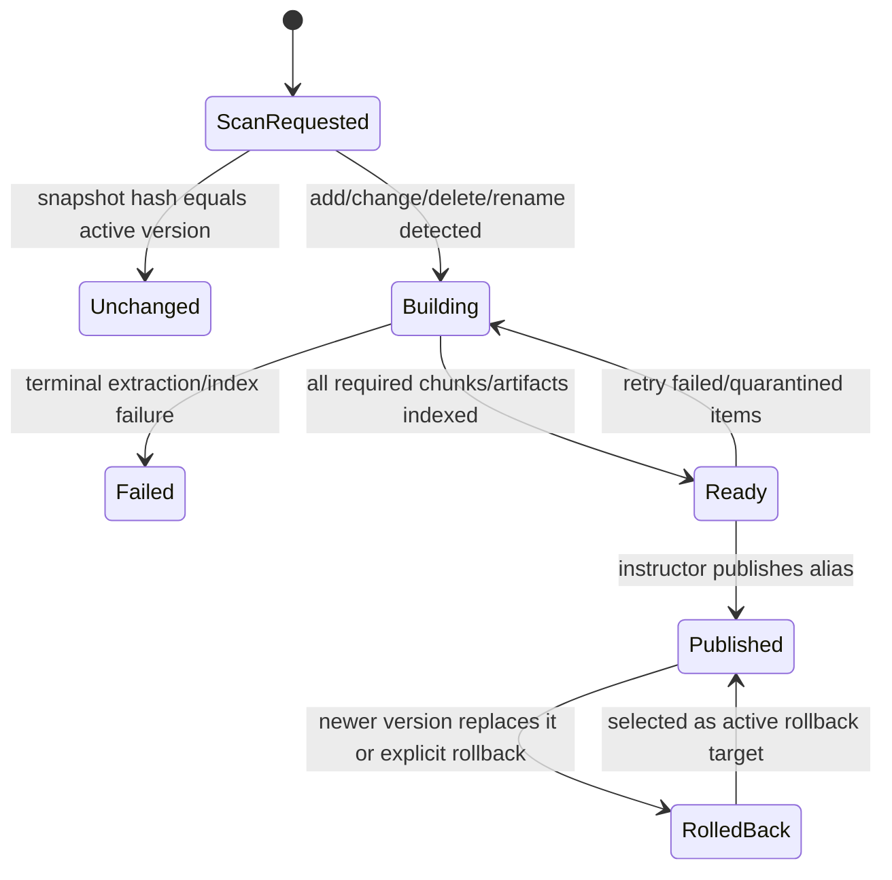

# Design Specification — Course Tutor Platform

**Status:** Baseline v0.2
**Date:** 2026-09-09
**Companion:** [Function Specification](function-spec.md)
**Task plan:** [Delivery Task Index](tasks/task-00-index.md)

## 1. Architecture decisions

- Python 3.12 + FastAPI remains the backend stack; React + TypeScript remains the Web stack.
- There are two backend product apps: existing `apps/api` is deployed as `agent-api`; new `apps/practice` is deployed as `practice-api`.
- The ingestion worker is a background Agent workload, not a third product app.
- Agent API owns course/content/session/memory persistence. Practice API consumes contracts and never imports Agent API ORM or business modules.
- The repository starts as a modular monorepo but each deployable has an explicit process, image, configuration and OpenAPI contract.
- Kubernetes packaging uses one Helm v3 application chart with workloads independently
  enabled and scaled. This chart is the sole supported install/upgrade/rollback entrypoint.

See [ADR-004](adr/004-two-backend-apps-and-data-ownership.md).

## 2. Current implementation status

| Area | Status | Evidence/gap | Owning task |
|---|---|---|---|
| Python workspace, ORM, migration, health probes | partial | Unit/static checks exist; request dependency lifecycle and production security are unsafe | TASK-02 |
| One-time Leeds ingestion and dense indexing | partial | Existing data is indexed; recurring version lifecycle, MinIO identity and concurrent claims are incomplete | TASK-03 |
| Grounded chat | implemented | ACL-filtered dense retrieval, bounded evidence, validated citations and true SSE streaming | TASK-02, TASK-04 |
| RAG evaluation | planned | Current benchmark file defines fixtures but does not execute retrieval metrics | TASK-05 |
| Session/long-term memory | planned | DTO/ORM tables only; no service/API/recall path | TASK-06 |
| Teaching/assessment policy | planned | Course level exists; runtime policy is not enforced and chunk class is lost during coalescing | TASK-03, TASK-06 |
| Practice API | implemented dummy | Independent app exposes probes, capabilities and authenticated deterministic 501 | TASK-07 |
| Reproducible production images | partial | Images build, but runtime dependencies/security/versioning need work | TASK-08 |
| Kubernetes/Helm | planned | No manifests exist | TASK-09 |
| CI | partial | Python checks exist; safe integration, frontend, image and Kind deployment gates are absent | TASK-05, TASK-10 |
| CD/HA/runbooks | planned | Cluster/provider not selected | TASK-11, TASK-12 |

No Phase 1 or Phase 2 completion claim is made by v0.2 until its mapped task acceptance tests pass.

## 3. Target repository and deployables

```text
apps/
├── api/                       # Agent API source; image/service: agent-api
├── practice/                  # Practice API source; image/service: practice-api
└── web/                       # React UI
services/
├── ingestion/                 # Agent background worker
├── retrieval/                 # Agent-owned retrieval module
├── memory/                    # Agent-owned memory module
└── orchestrator/              # Agent workflow/policy module
packages/
├── contracts/
│   └── openapi/               # agent-api.v1.json, practice-api.v1.json
└── shared/                    # configuration, auth interfaces, telemetry, IDs
infra/
├── docker/
└── k8s/course-tutor/          # Helm chart
docs/
├── adr/
├── tasks/
└── requirements-traceability.md
```

| Deployable | Process | Owns durable data? | Scale unit |
|---|---|---|---|
| Agent API | FastAPI/uvicorn | Course/content/session/memory APIs; PostgreSQL remains source of truth | Stateless replicas |
| Practice API | FastAPI/uvicorn | None in dummy phase | Stateless replicas |
| Ingestion worker | Async worker | Writes Agent-owned content/outbox data | Queue depth/replicas |
| Web | nginx/static React | No | Static replicas/CDN |

## 4. Canonical API contracts

Contracts live under `packages/contracts/openapi/`; operation IDs are stable integration identifiers.

### Agent API

| Operation ID | Method/path | v0.2 status | Task |
|---|---|---|---|
| `agentHealth` | `GET /healthz` | implemented | TASK-02 hardening |
| `agentReady` | `GET /readyz` | implemented | TASK-12 completion |
| `listCourses` | `GET /v1/courses` | implemented | TASK-02 tenancy |
| `getCourse` | `GET /v1/courses/{course_id}` | implemented | TASK-02 tenancy |
| `streamCourseChat` | `POST /v1/courses/{course_id}/chat` | partial | TASK-02, TASK-04, TASK-06 |
| `createProgramme` | `POST /v1/admin/programmes` | implemented | TASK-03 |
| `createCourse` | `POST /v1/admin/courses` | implemented | TASK-03 |
| `createCourseIngestion` | `POST /v1/admin/courses/{course_id}/ingestions` | implemented | TASK-03 |
| `getIngestion` | `GET /v1/admin/ingestions/{job_id}` | implemented | TASK-03 |
| `retryIngestion` | `POST /v1/admin/ingestions/{job_id}/retry` | implemented | TASK-03 |
| `listCourseSources` | `GET /v1/admin/courses/{course_id}/sources` | implemented | TASK-03 |
| `getCourseSource` | `GET /v1/courses/{course_id}/sources/{source_id}` | implemented | TASK-02, TASK-03 |
| `publishContentVersion` | `POST /v1/admin/courses/{course_id}/versions/{version_id}/publish` | implemented | TASK-03 |
| `rollbackContentVersion` | `POST /v1/admin/courses/{course_id}/versions/{version_id}/rollback` | implemented | TASK-03 |
| `listMemories` | `GET /v1/memories` | planned | TASK-06 |
| `updateMemory` | `PATCH /v1/memories/{memory_id}` | planned | TASK-06 |
| `createFeedback` | `POST /v1/feedback` | planned | TASK-05 |

The legacy `POST /v1/admin/ingest` prototype has been removed. Registration does not create a content version; manual or scheduled ingestion creates one only after snapshot change detection.

### Practice API

| Operation ID | Method/path | v0.2 status | Task |
|---|---|---|---|
| `practiceHealth` | `GET /healthz` | implemented | TASK-07 |
| `practiceReady` | `GET /readyz` | implemented | TASK-07 |
| `getPracticeCapabilities` | `GET /v1/practice/capabilities` | implemented | TASK-07 |
| `generatePracticeExercises` | `POST /v1/practice/courses/{course_id}/exercises:generate` | implemented dummy 501 | TASK-07 |

## 5. Data ownership and contracts

The Agent PostgreSQL schema is the canonical store for tenant, programme, course, course run, content version, source/chunk metadata, sessions, memories, feedback and outbox state. Qdrant and any memory vector index are rebuildable projections. MinIO holds source/extraction artifacts. Redis holds cache, locks and bounded ephemeral state only.

Practice API receives authenticated identity and a course ID. During the dummy phase it may call an Agent authorization endpoint or shared authorization adapter, but it performs no generation and persists nothing. Future practice entities require a separate ADR before schema ownership is assigned.

Cross-module Python imports follow dependency direction:

```text
apps -> domain/application interfaces -> provider adapters
services -> contracts/shared interfaces
practice -X-> agent ORM/internal routes
retrieval/ingestion -X-> FastAPI route modules
```

## 6. Ingestion lifecycle



- Default scheduler interval: 15 minutes, configurable; manual trigger uses the same idempotent command.
- Snapshot comparison keys are normalized relative path, checksum, size and parser metadata. Rename detection may reuse checksum-matched artifacts.
- Each new snapshot receives a monotonically increasing sequence and one shared pipeline version.
- Consumers claim outbox rows using row locks/leases and commit status transitions with their result.
- Automatic publication is disabled by default.
- Production SourceRoots are read-only PVCs; deleted files remain available in historical immutable versions/artifact retention.

## 7. RAG and streaming design

1. Authenticate and derive tenant/membership/access rank server-side.
2. Resolve the course run’s published content version.
3. Retrieve dense candidates with tenant/course/version/ACL filters in the vector query,
   then apply the explicitly named lexical rescoring baseline.
4. Apply score/diversity ordering, preserving final evidence order. A separate lexical
   recall source and rank fusion remain subject to TASK-05 benchmark evidence.
5. Assign `[Source N]` only after the final evidence list is fixed.
6. Stream safe visible content; hold only a bounded suffix needed to detect the hidden citation trailer.
7. Validate cited source number and chunk ID against final evidence.
8. Persist trace terminal state independently of client completion.
9. Extract/update memory asynchronously after the response policy allows it.

The baseline quality gate is Recall@5 ≥ 0.85, citation precision ≥ 0.95 and unsupported-query abstention F1 ≥ 0.90 on approved evaluation sets. TTFT targets are defined in the Function Specification.

## 8. Memory and teaching defaults

- Production long-term memory is opt-in; session context remains bounded and follows chat retention.
- Rolling summary ≤ 500 tokens; recalled facts ≤ 8 and ≤ 350 tokens.
- Candidate types remain closed: goal, knowledge level, language/style, stable constraint, misconception, mastery signal and active study plan.
- Deterministic key dedup runs before semantic similarity. Conflicts do not silently overwrite provenance.
- Tombstones block recall immediately; purge removes derived projections and records completion.
- Course teaching policy defines education level, hint stages, solution-release rule and assessment labels.
- Raw request values never override role, tenant or access rank.

## 9. Kubernetes and CI/CD target

One Helm v3 application chart, `course-tutor`, deploys Agent API, Practice API, worker
and Web. It contains `Chart.yaml`, default `values.yaml`, `values.schema.json`, templates,
tests and environment overlays. Chart and `appVersion` values are versioned separately;
CI packages the chart as `course-tutor-<chart-version>.tgz`, while CD may publish the
same immutable artifact to an OCI registry such as GHCR.

`helm upgrade --install --atomic --wait` is the normal deployment command and
`helm rollback` is the recovery interface. Generated YAML may be inspected and policy
validated, but production releases do not maintain or apply a second set of handwritten
Kubernetes manifests.

Production data services may be external; CI uses disposable dependencies and fake
LLM/embedding services. Course content is supplied through an existing read-only PVC
with optional SMB CSI configuration through Secret references. Values are layered as
base defaults plus CI, local and production-example files; production overlays contain
references to Secrets, never secret values.

Pull-request CI must run:

1. Python and frontend static/unit checks.
2. Disposable integration/e2e and RAG benchmark gates.
3. Reproducible builds and security scans for all images.
4. Helm lint/template/schema/policy validation.
5. Kind install and smoke calls for Agent, Practice, worker and Web.

CD publishes immutable GHCR image digests, deploys the exact tested digests with an atomic Helm rollout, performs post-deploy smoke tests and supports rollback. Production activation remains blocked only on external cluster/identity/secret-manager configuration, not on an unresolved application architecture choice.

## 10. Security and resilience defaults

- Production startup rejects local/disabled auth and placeholder secrets.
- OIDC/JWT claims are mapped to tenant/user; course membership is resolved server-side.
- PostgreSQL RPO 24 h/RTO 4 h; Qdrant/object projections are snapshotted but remain rebuildable.
- Agent chat availability includes inference availability; a second compatible inference node is required to remove the single-node dependency.
- API workloads are stateless; workers are idempotent and lock claimed jobs.
- Logs/traces omit prompt/source/memory values by default.

## 11. Delivery source of truth

Implementation tasks and acceptance tests are maintained in `docs/tasks/`. Requirement-to-task/operation/test mapping is maintained in `docs/requirements-traceability.md` and validated by `scripts/validate_contract_baseline.py`.

External choices still required before production CD activation:

- Kubernetes provider/cluster and ingress DNS.
- OIDC provider and claim mapping.
- Secret manager/external-secrets integration.
- Approved Leeds evaluation content and institutional retention overrides.
