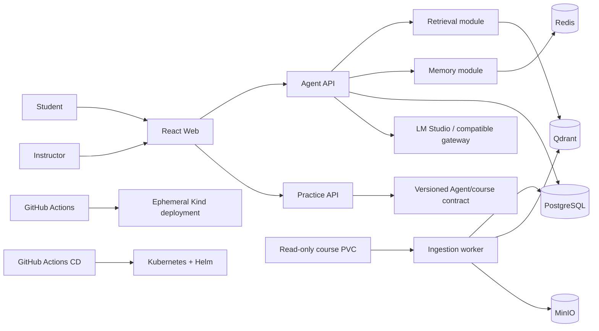

# Function Specification — Course Tutor Platform

**Status:** Baseline v0.2
**Date:** 2026-09-09
**Initial programme:** University of Leeds · MSc Artificial Intelligence
**Languages:** Chinese and English
**Deployment posture:** local-first inference; Helm-packaged Kubernetes deployment

## 1. Product outcome

The platform helps a learner study a selected course from instructor-provided materials. It ingests a periodically updated mounted NAS directory, answers with traceable citations, adapts explanations to the learner, and retains only compact, controlled learning memory.

The platform has two backend product applications:

1. **Agent API** (`apps/api`, runtime name `agent-api`) owns courses, source ingestion, retrieval, tutoring chat, sessions and learner memory.
2. **Practice API** (`apps/practice`, runtime name `practice-api`) is the boundary for future exercise generation. In v0.2 it is a dummy service and does not generate questions.

The ingestion worker and React Web UI are supporting workloads, not additional backend product apps.

## 2. Scope

### MVP scope

- Ingest PDF, PPTX, DOCX, Markdown and text files; use OCR for scanned PDFs.
- Detect source additions, modifications, deletions and renames through periodic scans.
- Build immutable content versions and explicitly preview, publish or roll back them.
- Provide tenant- and course-scoped grounded chat with navigable source citations.
- Stream Agent responses and abstain when retrieved evidence is insufficient.
- Maintain bounded session context and optional compact long-term learner memory.
- Apply configurable teaching level and assessed-work hint policies.
- Expose a deployable Practice API dummy contract.
- Package every Kubernetes workload as one versioned Helm chart. Helm is the supported
  installation, upgrade and rollback interface; CI verifies the rendered release and
  a real installation in an ephemeral cluster.

### Not in v0.2

- Actual random-exercise generation, grading, adaptive question selection or attempt history.
- Fully autonomous assessment decisions or replacing official instructor guidance.
- Direct SMB credential handling inside the applications.
- Production CD activation before a cluster provider and secret manager are selected.

## 3. Domain hierarchy and source mapping

| Entity | Meaning | Example |
|---|---|---|
| Tenant | Institution/security boundary | University of Leeds |
| Programme | Group of courses | MSc Artificial Intelligence |
| Course | Academic module | OCOM5105M Mathematical Foundations of AI |
| CourseRun | Time-bounded delivery | 2026–27 semester 1 |
| SourceRoot | Mounted read-only directory registered to a course run | `/Volumes/home/University of Leeds/modules/OCOM5105M` |
| ContentVersion | Immutable snapshot built by one ingestion pipeline version | sequence 4, pipeline 1.2.0 |

A SourceRoot belongs to one CourseRun. One higher-level NAS directory may contain multiple modules, but each module must have an explicit SourceRoot mapping; the scanner must not infer tenant/course ownership from arbitrary folder names. The first migration may map the existing `Course` row to both Course and current CourseRun, but the API contract uses explicit course-run semantics for new data.

`smb://L-NAS` is mounted by the host or Kubernetes SMB CSI driver. Applications receive a read-only POSIX path/PVC and never receive an SMB URL as a source path. Credentials are referenced from a secret store and are not committed.

## 4. Functional requirements

### Course and ingestion

| ID | Requirement |
|---|---|
| FR-1.1 | An instructor can register a programme, course, course run and validated SourceRoot without recreating the tenant on every ingestion. |
| FR-1.2 | A scheduled or manual scan detects file add/change/delete/rename and creates a new immutable ContentVersion only when the snapshot changed. |
| FR-1.3 | Scan and embed jobs are idempotent under retry and concurrent workers; unchanged artifacts may be reused safely. |
| FR-1.4 | A successful build progresses `BUILDING → READY`; an instructor can preview, publish and roll back by changing the active-version alias. |
| FR-1.5 | Unsupported, protected, low-confidence or failed files are quarantined with status, reason, retry action and source anchor. |
| FR-1.6 | Source originals/extraction artifacts use canonical tenant/course-run/source IDs and are retrievable only after authorization. |

Default scan interval is 15 minutes and is configurable. Manual scans are always available to instructors. Automatic publication is off by default; a READY version requires explicit publication. Deletions affect only the new version until it is published.

### Grounded tutoring chat

| ID | Requirement |
|---|---|
| FR-2.1 | An authenticated learner selects an authorized course run and submits a question in Chinese or English. |
| FR-2.2 | Retrieval filters tenant, course run, active version and server-derived access rank before candidate selection. |
| FR-2.3 | Retrieval combines semantic and lexical recall; any baseline substitute must be named accurately and evaluated. |
| FR-2.4 | The final evidence pack is reranked, source-diverse and bounded by tokens. Every emitted citation maps to evidence actually sent to the LLM. |
| FR-2.5 | The Agent streams answer events as they are generated and never exposes its hidden citation-control trailer. |
| FR-2.6 | Weak, conflicting or absent evidence produces a transparent abstention rather than an unsupported course claim. |
| FR-2.7 | Retrieval traces record candidates, final evidence, scores, timings, policy/model versions and terminal stream state. |

### Learning and teaching behavior

| ID | Requirement |
|---|---|
| FR-3.1 | Explanations apply the configured primary, middle-school, high-school, undergraduate or postgraduate teaching level. |
| FR-3.2 | The Agent can create cited summaries, flashcards and clearly labeled original practice prompts from authorized evidence. |
| FR-3.3 | Exercise/solution/assessment chunks retain their class; assessed work defaults to progressive hints and withholds stored solutions until policy allows. |
| FR-3.4 | The Practice API exposes capabilities and a reserved generation endpoint; v0.2 returns HTTP 501 `practice_generation_not_implemented`. |

### Session and long-term memory

| ID | Requirement |
|---|---|
| FR-4.1 | Session memory stores a bounded recent-turn window and rolling summary scoped to authenticated user and course run. |
| FR-4.2 | Long-term memory is disabled by default in production until the learner opts in; enabled memory stores typed atomic facts, not raw transcript copies. |
| FR-4.3 | Candidate facts pass schema, scope, sensitivity, confidence and evidence validation before promotion. |
| FR-4.4 | Equivalent facts merge provenance; conflicts are retained for confirmation; confidence, relevance and expiry are type-aware. |
| FR-4.5 | Recall is course-scoped by default and capped at 8 facts/350 tokens; rolling summaries are capped at 500 tokens. |
| FR-4.6 | Learners can inspect, correct, pin, export and delete memory; tombstones take effect immediately and derived copies are purged asynchronously. |

Production retention defaults are: raw chat turns 30 days, session summaries 90 days, misconception/mastery facts 90 days, and explicitly saved preferences/goals 365 days. Tenant policy may shorten these values. Pinned facts remain until deletion or tenant maximum retention.

### Identity, authorization and privacy

| ID | Requirement |
|---|---|
| FR-5.1 | Production requires OIDC/JWT authentication; disabled/local identity is permitted only in local and test environments. |
| FR-5.2 | Tenant, role, membership and access rank are derived server-side and cannot be raised through request fields. |
| FR-5.3 | Student, teaching-assistant, instructor and platform-admin operations follow least privilege; administrative changes are audited. |
| FR-5.4 | Logs/traces exclude source text, raw prompts, tokens and memory values by default; secrets are externalized. |
| FR-5.5 | The interface labels AI-generated content and does not present it as official instructor guidance. |

### Practice API dummy

| ID | Requirement |
|---|---|
| FR-6.1 | Practice API starts and scales independently of the Agent API process. |
| FR-6.2 | Health, readiness and capabilities endpoints expose service/build status without leaking configuration. |
| FR-6.3 | The reserved generation endpoint verifies identity and course access, persists nothing, and returns deterministic HTTP 501 until its product specification is approved. |

## 5. Canonical API surface

The versioned source of truth is:

- `packages/contracts/openapi/agent-api.v1.json`
- `packages/contracts/openapi/practice-api.v1.json`

Each operation contains `x-implementation-status`: `implemented`, `partial` or `planned`. The former non-canonical `POST /v1/admin/ingest` prototype was removed in TASK-03; programme/course/run registration and `POST /v1/admin/courses/{course_id}/ingestions` are now separate operations.

## 6. System context

Agent API is the system of record for tenant, programme, course run, content, authorization, sessions and memory. Practice API may consume versioned contracts or an authorized Agent API, but must not import Agent API persistence/business modules or create duplicate ownership.

## 7. Non-functional requirements

| ID | Requirement/target |
|---|---|
| NFR-1 | End-user Agent chat availability target is 99.5% monthly including the configured inference dependency; Practice dummy health target is 99.5%. |
| NFR-2 | On the target LAN and warmed services, Agent time-to-first-token is P50 < 3 s and P95 < 8 s; no request may wait indefinitely. |
| NFR-3 | On the approved benchmark, retrieval Recall@5 ≥ 0.85, citation precision ≥ 0.95 and unsupported-query abstention F1 ≥ 0.90. |
| NFR-4 | Ingestion is at-least-once and idempotent; worker restart/duplicate delivery creates no duplicate source, chunk, artifact or vector. |
| NFR-5 | PostgreSQL/content metadata MVP RPO is 24 h and RTO is 4 h; restore and rollback drills are required before release. |
| NFR-6 | Structured logs, metrics and traces carry correlation IDs with bounded-cardinality labels and no sensitive payload by default. |
| NFR-7 | Kubernetes delivery uses one versioned Helm chart as the supported packaging/deployment interface. The chart must deploy non-root workloads with resource limits, readiness/liveness probes, rolling updates, secret references and least-privilege network access; production releases must not rely on hand-maintained `kubectl apply` manifests. |
| NFR-8 | Pull requests must pass unit/integration/e2e, RAG gates, image builds, Helm validation and an ephemeral Kind smoke deployment of both backend apps. |
| NFR-9 | Releases use immutable image digests and a verified Helm rollout with rollback support. |

## 8. Release acceptance

An MVP release is acceptable only when:

1. A generated fixture and an approved Leeds evaluation set pass the RAG thresholds.
2. File add/change/delete/rename produces a previewable new version and repeated/concurrent jobs remain idempotent.
3. Student requests cannot retrieve staff/restricted evidence and cross-tenant access tests pass.
4. Source citations resolve to the exact page/slide/chunk sent to the LLM.
5. The first SSE token arrives before generation completes.
6. Memory deduplication, correction, expiry and deletion tests pass with long-term memory opt-in.
7. `helm package` produces a versioned chart archive, and `helm upgrade --install`
   deploys Agent API, Practice API, worker and Web into a clean Kind cluster where all
   smoke calls pass.
8. `helm rollback` restores the previous healthy release, and the Kubernetes rollback
   and data restore drills meet the declared targets.

Traceability from these requirements to tasks, operations and tests is maintained in `docs/requirements-traceability.md`.
