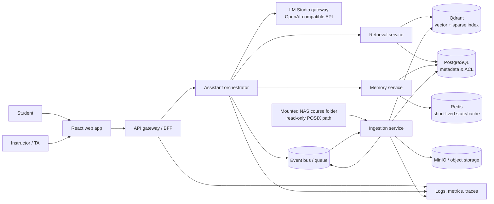
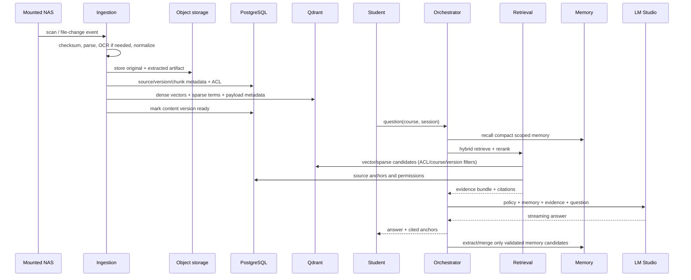

# Function Specification — AI Course Tutor Agent

**Status:** Draft v0.1  
**Initial tenant/course:** University of Leeds · MSc Artificial Intelligence  
**Primary language:** Chinese and English  
**Deployment posture:** local-first; local LM Studio inference with self-hostable state stores.

## 1. Problem and outcome

The system is a course-specific teaching assistant. It ingests instructor-provided slides, exercises and supporting course files, answers questions with traceable course citations, and adapts its teaching to the learner across sessions. It must be reusable across education levels by configuring a curriculum and teaching policy rather than rewriting the platform.

The first usable outcome is a student who can ask, in Chinese or English, “Explain Week 3’s Bayesian-network exercise step by step”, receive a bounded explanation with slide/page citations, and resume later without repeating their current mastery level or preferences.

## 2. Scope

### In scope (MVP)

- Discover and ingest PDF, PPTX, DOCX, Markdown, text and image-OCR course material from a configured local directory.
- Preserve course/module, week/topic, source file, page/slide, version, permission label and extraction confidence as metadata.
- Answer course questions, explain concepts at a chosen education level, offer hints before solutions, and generate cited summaries/practice questions.
- Retrieve using hybrid search (dense vector + lexical) and rerank results before the LLM call.
- Stream responses from LM Studio’s OpenAI-compatible API.
- Maintain session memory and compact learner-profile/learning-progress memory with user controls.
- Teacher/admin ingestion status, source list, failure retry, and index/version visibility.

### Explicitly out of scope (MVP)

- Fully autonomous grading, high-stakes academic decisions, browser/cloud search, and replacing a lecturer’s official instructions.
- Accessing SMB with embedded credentials. The host must mount the NAS and expose a least-privilege local read-only path.
- Cross-course learner profiling unless the learner grants consent and the institution enables it.

## 3. Users and permissions

| Role | Key capabilities |
|---|---|
| Student | Course chat, cited sources, preferences, memory export/delete, feedback |
| Teaching assistant | Student capabilities plus approved content drafts and anonymized retrieval-quality review |
| Instructor | Manage module/course materials, publish index versions, set answer/hint policies, view aggregate usage |
| Platform administrator | Tenant setup, identity integration, service configuration, audit and retention policies |

Tenant → institution; course → module/run; source and memory are always tagged with tenant/course and authorization scope. Retrieval never crosses these filters.

## 4. Functional requirements

### FR-1 Course and source management

1. An instructor registers a course, module/run and a local source root.
2. The ingestion service performs initial and incremental scans using file checksum plus metadata, so unchanged files are not reprocessed.
3. Each ingestion produces an immutable `content_version`; new versions can be previewed before publication and rolled back by changing the active alias.
4. Unsupported, password-protected or low-confidence OCR files are quarantined with an actionable failure record.

### FR-2 RAG answer flow

1. Student selects a course and submits a question.
2. The assistant detects the language and asks only essential clarification when course, task or level is ambiguous.
3. Retrieval filters to active course versions, executes lexical and semantic recall, then reranks candidates.
4. The assistant uses only supplied evidence for course-specific factual claims. It presents citations with file title, version and page/slide/chunk anchor.
5. When evidence is weak, conflicting or absent, it says so, suggests a refinement, and must not invent a course answer.
6. Exercises use a configurable pedagogy: default to a progressive hint, then outline, then solution only after an explicit request; honor instructor policy for assessed work.

### FR-3 Learning support

- Explain at selected level (primary, middle school, high school, undergraduate, postgraduate) with an appropriate vocabulary/pacing policy.
- Create revision summaries, flashcards and original practice questions based on retrieved objectives, marking generated content clearly.
- Track optional learner goals, current topic, demonstrated misconceptions and preferred explanation style.

### FR-4 Memory

**Working memory**: last relevant dialogue turns plus a rolling conversation summary, scoped to a chat/session and with short retention.

**Long-term memory**: compact atomic facts and periodic learner-state summaries. Each item contains `type`, `value`, `course_scope`, `evidence_turn_ids`, `confidence`, `importance`, `created_at`, `last_confirmed_at`, `expires_at`, and `supersedes`.

Allowed initial types: learning goal, knowledge level, preferred language/style, stable constraint, misconception, mastery signal, and active study plan. Raw personal details and unsupported inference are not promoted.

**Extraction/compaction policy**:

1. After a meaningful turn, an LLM extracts only candidate facts in a strict JSON schema; deterministic validation rejects unscoped/sensitive/low-confidence candidates.
2. Candidate facts are normalized and compared within the same learner + course + type using embedding similarity and key fields.
3. Exact/near duplicates merge evidence and refresh confirmation instead of creating another item. Conflicts retain provenance, reduce confidence, and replace only after confirmation or stronger new evidence.
4. At session close or a token threshold, the service writes a bounded summary of progress, unresolved questions and next action. It keeps links to source turns but does not copy whole transcripts.
5. Recalled memory is limited by course scope, expiry, importance and relevance. It is injected as a labeled, small context block, not as untrusted instructions.
6. Learners can inspect, correct, pin, export or delete memory. Deletion propagates to materialized summaries and vector entries via a tombstone job.

### FR-5 Safety and academic integrity

- Clearly label AI-generated material and cite course sources.
- Avoid giving a final answer to configured live assessments; use hints and refer learners to course policy.
- Do not claim that a response is official instructor guidance.
- Enforce tenant/course authorization before document, chat, memory or audit access.

## 5. Non-functional requirements

| Area | MVP target |
|---|---|
| Availability | Stateless API/orchestrator replicas; target 99.5% service availability excluding a single local LM Studio host |
| Latency | Stream first token under 3 s at P50 on LAN after retrieval; expose component timings |
| Reliability | At-least-once ingestion events, idempotent checksum/version writes, retries with dead-letter queue |
| Security | TLS in deployment, OIDC-ready auth, secrets externalized, encrypted state-store volumes/backups, role and tenant checks |
| Privacy | Data-minimized memory, configurable retention, export/delete, audit trail without prompt content by default |
| Observability | Structured logs, correlation IDs, metrics/traces, RAG quality feedback and retrieval evaluation set |
| Scalability | Independently scale API, workers, retrieval, memory and model gateway; partition by tenant/course |

## 6. System context

## 7. Technical architecture

### 7.1 Deployable services

| Service | Responsibility | Scaling/availability boundary |
|---|---|---|
| Web app | React UI, token-safe streaming display, citation reader | CDN/static replicas |
| API gateway/BFF | AuthN/AuthZ, request validation, SSE/WebSocket stream, rate control | Stateless horizontal replicas |
| Orchestrator | Prompt assembly, tool workflow, policy enforcement, answer verification | Stateless workers; queue-backed long jobs |
| Ingestion | File watch/scan, extract, chunk, embed, upsert/version/publish | Horizontally scaled jobs; idempotency key `(course, checksum, pipeline_version)` |
| Retrieval | ACL-filtered hybrid recall, rerank, citations | Stateless replicas with Qdrant/Postgres read dependencies |
| Memory | Session summaries, fact extraction, merge/relevance/revocation | Stateless workers; durable PostgreSQL record of truth |
| Model gateway (optional initially) | OpenAI-compatible adapter, timeouts/retries/model routing | Isolates LM Studio and enables future local/cloud model changes |

Start as a **modular monolith deployment with separable packages** to minimize operational cost, but retain explicit HTTP/gRPC and event contracts. Extract services when worker load, release cadence, or failure isolation makes it valuable. This avoids premature microservice coordination while keeping migration straightforward.

### 7.2 Data and RAG path

### 7.3 Storage model

- **PostgreSQL**: tenants, users/roles, courses, content versions, source metadata, chunks, chats, durable memory facts, summaries, feedback, audits and outbox events.
- **Qdrant**: chunk embeddings plus filterable payload (`tenant_id`, `course_id`, `content_version`, `source_id`, `chunk_id`, access label); separate collections per embedding model/version.
- **Object storage**: source originals, extraction artifacts and optional rendered slide/page assets. Original content is never placed directly in the vector database.
- **Redis**: session window, distributed locks, rate limiting, queues/cache. It is not the source of truth.

### 7.4 Model integration

The adapter implements the OpenAI-compatible `chat/completions` (streaming) and `embeddings` interfaces against `LLM_BASE_URL`. It uses finite connect/read timeouts, circuit breaking and per-request correlation IDs. Model name, prompt template and embedding dimension are configuration/versioned metadata. The system fails closed for a course answer when the embedding model or collection dimension does not match.

### 7.5 NAS integration

`smb://L-NAS` is a client mount address, not an application path. On macOS/Linux, mount it through the OS with a dedicated read-only service account, then configure `COURSE_SOURCE_PATH` to the mounted absolute POSIX directory. The ingestion container receives that directory as a read-only bind mount. A periodic scanner is the baseline because SMB file-watch semantics vary; it may later consume a filesystem event adapter where reliable.

### 7.6 Operations and high availability

- Put API, orchestrator, retrieval and memory behind a load balancer; make all request state external.
- Use transactional outbox + queue consumers for ingestion, summary, deletion and reindex jobs; every consumer is idempotent.
- Run PostgreSQL with managed HA/replication and tested point-in-time recovery; use Qdrant snapshots/replicas appropriate to data volume.
- Treat the first LM Studio machine as a single availability dependency. Add a second compatible local inference node plus health-aware routing for real HA.
- Deploy with Docker Compose locally, Kubernetes/Helm in production; autoscale workers on queue depth and retrieval/API on CPU/latency.
- Back up Postgres, object storage and Qdrant snapshots; test restore periodically.

## 8. Acceptance criteria for MVP

1. A newly added Leeds module PDF/PPTX becomes searchable without manual re-upload, and a status page shows parsed/failed state.
2. A course answer includes at least one navigable source anchor when evidence exists; unsupported claims generate a transparent abstention.
3. A follow-up conversation uses the learner’s course-scoped preference/progress without reintroducing duplicate memories after repeated turns.
4. Deleting a learner memory prevents it being recalled and completes asynchronously with an auditable status.
5. Restarting a worker does not duplicate indexed chunks or messages.
6. A simulated LM Studio outage produces a user-safe error and traceable health signal, not a hung chat request.
